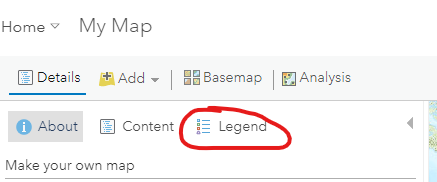
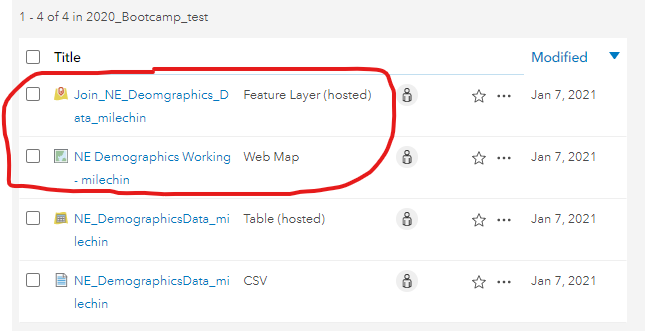
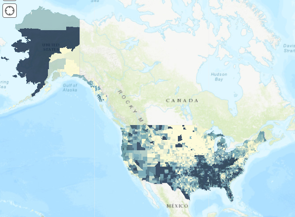

# ArcGIS Online - Part 1
### Author: Dennis Milechin, Research Computing Services, Boston University

## Download Data

**First we need to download the data we will use.  Please download the CSV file linked below.**

1. Right click on the link below and click on `Save Link As...`.

 [NE_DemographicsData.csv](https://raw.githubusercontent.com/bu-rcs/bu-rcs.github.io/main/Bootcamp/Data/NE_DemographicsData.csv)
 
2. In the dialogue box save the file as `NE_DemographicsData.csv`

3. Alternative, you can click on the link and then right click on the page and select `Save As` or `Save Page As` and save the file as `NE_DemographicsData.csv`.

## Uploading Data

1. Log onto ArcGIS Online portal.
2. At the top menu click on `Content` and `My Content`.

3. Click on `Add Item` -> `From Your Computer`

4. A new window will appear.  Click on `Choose` file and select the CSV file to upload.

5. In the title field, append your username at the end. This is needed because the hosted table needs to be unique within the BU origanization.  So we all cannot create a hosted table with the same name.
6. Add tags, such as `Health Ranking Data`.
7. Make sure `Publish this file as a hosted layer` is selected.
8. Since the table contains no coordinates or addresses, under `Locate features by:`, select `None, add as table`.  The top portion of the form should look like this:

9. If needed scroll down to the table that lists all the fields of the CSV file.

**For Field Name `FIPS` we need to make sure this is a `String` Field Type in order to retain the leading zeros format.  This will be important for joining the CSV file with a county layer later.**

10. For the `FIPS` row, click on `Integer` and select `String`

11. Scroll further down until you see the `Add Item` button.  Click on the `Add Item` button. 

**This will take you to the page that provides description of the hosted. At the moment all the fields are blank, so let's update the `Description` field.**

12. Under the `Description` section, click on `Edit` on the far right.

13. Type in a description, such as:

> Demographic data for New England states only.

14. Scroll further down, and on the right side, find the section `Credits (Attribution)`.

15. Click on `Edit` and paste the following to give credit to the original generators of the data: 

> University of Wisconsin Population Health Institute. County Health Rankings & Roadmaps 2019. www.countyhealthrankings.org.

16.  Feel free to update other description options available on this page.

**Next, let's explore some of the blue tabs at the top of the page.**

17. Click on `Data`, to view the data that was just uploaded.
18. Click on `Usage` to see how frequently this data is used by you or others.
19. We will ignore `Settings` tab for now, as the default settings will satisfy our needs.

## Find County Boundaries Layer

**In this section we will find a the United States County Layer that is already published on ArcGIS Online via the Living Atlas repository.  We will add this layer to our favorites so we can refer to it later.**
 
1. Log onto ArcGIS Online.
2. In the top menu click on `Content`.
3. In the Content submenu click on `Living Atlas` on the far right.

4. Search Living Atlas for USA County Boundary data.  In the search field type in `United States County Boundaries 2018`.

5. Click on `United States County Boundaries 2018` title.

6. If you cannot find this layer, click on the following link that will take you directly to the page:

 [United States County Boundaries 2018](https://bucas.maps.arcgis.com/home/item.html?id=e4920148fce0481b96076e1683aae943)
 
**Take a look at the description of the layer to learn more about this layer.**

7. Let's see what data it contains by clicking the `Data` tab in the blue sub-menu below your profile name.

8. Click on Hamburger menu on the top right of table and click on `Show/Hide Columns`.

**We can see that there are additiona columns available.  We can enable them by click on the check box.**

9. Click on the `FIPS` checkbox to make it appear.

**The FIPS column is important because we will use this column to match the FIPS numbers in our CSV file and join the two data sets together.**

10. Click on the `Overview` tab to get back to the description.
11. We want to use this layer later, so mark it as favorite.  Under the preview image of the data, click on the star, to add it to our Favorites.

12. Click on `Content`, in the top menu and then on `My Favorites` to see the list of items you had favorited.

## Explore Map Viewer

**Now let's learn how to use the Map Viewer.**

### Start the Map Viewer
1. Log onto ArcGIS Online.
2. Top menu click on `Map`. This will load the map viewer.

**You might be asked if you want to try the Beta version of Map Viewer.  This tutorial will focus on the current stable release, so decline the request.**

**Let's review some basic navigation tools availabe in this environment.**

1. To pan, move the mouse to the map pane, left click and drag, and then release.
2. To zoom in, click the `+` button located at the top left of the map viewer.
3. To zoom out, click the `-` button.

4. If you have a mouse with a scroll wheel or options, you can use that to zoom in and out as well.
5. To reset your view, click on the button that has the icon of a house, also known as the `default extent`, located between the `+` and `-` buttons.

**Near the top right, there is a `Find address or place` field where we can type in and address or location name.**

6. Type in `Boston University` and hit the enter key on your keyboard.

**The result is the web map will zoom onto the location of Boston University Charles River Campus.  We can save this view by saving it as a bookmark.**

7. To the left of the `Find address or place` search field is a button titled `Bookmarks`.  Click on the button and then `Add Bookmark`.

8. Type in `Boston University` and hit enter on your keyboard.  This now saved this extent as a bookmark.
9. To test the book mark, click on the `Default Extent`, to return the view of the United States.

10. Click on the `Bookmarks` button and then on `Boston University`.  This will zoom back to the extent of the bookmark.

### Measure Tool
**ArcGIS Online provides us with some tools to measure things on the map. Let's learn more about the measure tool.**

1. Click on the `Measures` button which is to the left of the `Bookmarks` button.

**There are three options for measuring tools: area, linear distance, and location.**

2. Select the `Area` button, which is located on the far left of the pop-up window.

3. Move the mouse to the map, and left click to define the first vertex.
4. Move the mouse to another location and then left click to define the next vertex.
5. Continue the process to outline an area of interst.
6. When done, double left click to finalize the area, the results of the area is shown in the `Measure` pop-up window.

7. You can change the units of the result in the drop down menu on the far right, where it currently might be selected to `Sq Miles`.

**For `Distance` it is the the button next to `Area`.  Using this tool is nearly identical on how the area tool is used.  For `Location` tool (far right button) shows the coordinates for a clicked location and also the coordinates of the mouse, when it is hovering over the map.**

## Add a Layer
**Now let's add the `United States County Boundaries 2018` layer we had marked as our Favorite.**

### Add United States County Boundaries 2018 layer
1. Click on the `Default Extent` button to reset the mapview to the United States.
2. Top left, click the `Add` button --> `Search for Layers`.
  

**Left pane will change listing layers available in your `My Content` page.**

3. Click on `My Content` --> `My Favorites`. 
  

4. The `United States County Boundaries 2018` layer is listed. Click on the `+` button on the bottom left of the layer listing. 
  

**The layer appears in the map view pane.**

  

5. Click the back arrow located to the left of `My Favorites` to return to the content pane.

6. Click on `Content` tab, which is to the right of `About`. 

**This will show the layers that are available to be displayed on the map view.*

7. Click on the checkbox next to the `United States County Boundaries 2018` to toggle the visibility of the layer off and on.

6. Click on `Legend` tab, which is to the right of `Content`. 

**This pane shows the layer name and how that layer is symbolized in the map.** 

7. Return to Content tab by clicking `Content`. 

### Explore attribute table
**Let's explore the attribute data in this layer.**

1. Zoom into the map and then move a mouse over a county and click on it.

**This will generate a pop-up window.  In this pop-up window it will list the data associated with the county.**

2. Click on other counties to explore the data associated with the other counties.

**To view the all the features and attributes we need to open the attribute table.**

3. Hover over the `United States County Boundaries 2018` layer and you will see icons appear below the layer name.

4. Click on the `Show Table` icon.

**This will make the attribute table appear below the map viewer.**

5. You can sort the columns by clicking on the field name and selecting one of the sort options.

6. Click on the `2018 Total Population` field name and then click `Statistics` to see the statistics of the column.
7. Click on a row in the attribute table to highlight it.

8. Then click on the hamburger button at the top right of the attribute table and select `Center on Selection`.

**This will zoom the map viewer to the center of the selected feature.  You can select multiple features in the attribute table by holding down the `CTRL` key on your keyboard while clicking the rows.**

## Add Hosted Table (The CSV File uploaded)
**The next step is to add the CSV data we uploaded to ArcGIS Online earlier.**

1. Just like adding the `United States County Boundary 2018 layer`, click on `Add` --> `Search for Layer`
2. Make sure `My Content` is selected at the top.

3. The CSV data we apploaded earlier should no be visible.  Click on the `+` symbol to add the table to our map.

4. Click on the back arrow at the top of the pane to return to the `Content` page.

**The data is added as a table.  Nothing will appear on the screen because this data has no spatial information that would allow ArcGIS Online to plot this data on the map.  To plot data on the map we either need coordinates or addresses.  This is excercise we will join this data with the US County Boundaries 2018 layer we had found.**

5. Hover over the table layer you just imported and click on the `Show Table` icon.
6. Take a look at the table and confirm this is the same data as the CSV file.

## Save the Map.
**At this point it is good to save the map, so we don't lose our changes accidently.**

1. Upper mid-point of the window is a `Save` button.

2. Click on `Save` and then `Save As`.
3. A form will appear that you will need to fill out. Fill it out with the information below, but subsitute your username for my username where you see`_milechin`:

**The map is now saved.  Periodically, click on the `Save` --> `Save` button to save any changes while progressing through this workshop.**

## Join Table with County Layer

**Now let's join the table data we have with the US County Boundary layer, so we can plot the CSV data on the map.**

1. Click on the `Analysis` button near the top of the page, to the right of `Basemap`.
 
 
**The pane will appear and listing categories of analysis that can be done in ArcGIS Online.  We are only going to perform a `join` operation in this workshop.**

2. Click on `Summarize Data` to expand the list of tools available.
3. Click on `Join Features`.
 
 
**A form will appear.  We need to fill out the form to tell the tool what layers we want to join and how we are going to join them.  Remeber that both the US County Boundaries data and the CSV file have a FIPS code, which we will use as the key to join the two data sets.**

4. For `1 Choose target Layer` enter `United States County Boundaries 2018` and for `2 Choose layer to join to target layer` select the CSV layer `NE DemographicsData_<username>`.

5. For item 3, click on `Choose the fields to match`.

6. Then from the two drop down menus, select `FIPS` field as the joining field.

7. Make sure section 4 `Choose join operation` looks like the snippet below:

8. Use the following name for section `5 Result layer name`:
> Join_NE_Deomgraphics_Data_<username>

9.  Further down, uncheck the box for `Use current map extent`.  This will prevent only data that is currently visible in the map view to be considered in the join.

**Your form should look similiar to the snippet below**

**Before we run the analysis, we should check how much "credit" this analysis will consume.**

10. Click on the `Show Credits` link that is to the right of the `Use current map extent` checkbox.

**A window will appear and provide a summary of the credits that will be used.  In this example 2.724 credits will be used.**

11. Click `X` in the window to close it.
12. Now click the `RUN ANALYSIS` button at the bottom of the pane.

**Depending how large the datasets are, this can take a while to process.  You can still do other things within ArcGIS Online, while you wait for the analysis to complete.**

**Once the analysis is complete, a new layer will be added to the map `Content` pane with the name we had chosen for the layer in the form, `Join_NE_Deomgraphics_Data_<username>`**

**Let's zoom to the extent of the new layer if ArcGIS Online did not do it for us automatically.**

13. Hover over the new layer, and click on the three dots `...`, then click on `Zoom to`.

14. Click on `Legend` to see which symbology is being used for the new layer.

**In this example the color is blue for the new layer and we see only the New England states are shown.  Only New England states are shown because the CSV file only had New England states and we indicated in the section 4 of the form to `Join one on one`, which would remove any counties which were not found in the CSV file.**

15. Go back to Content pane by clicking `Content`.
16. Toggle off the visibility of `United States County Boundaries 2018` layer by clicking the checkbox next to the layer name.
17. To confirm the data joined properly, hover over the new layer and click on the `Show table` button.

**Take a look at the fields of the attribute table. You should see the fields from the `United States County Boundaries 2018` layer and also from the CSV data.**

18. Save the map.

## Look at My Content

**Let's navigate back to `My Content` page and see what new items were created.**

1. Top left of the page, click on `Home` --> `Content`

2. Make sure the `My Content` tab is selected at the top.

**In My Content, you should now see two additional items. A Web Map, which is the web map we just created, and a Feature Layer, which is the joined data layer we also just created.**

3. Click on the Web Map link `NE Demographics Working - <username>`.

**This will display the information page for this web map.  Just like when we updated the information page for the CSV data we uploaded, we can do the same thing here. A similiar description page is also available for the Feature Layer we just created.**

4. Top right, click the `Open in Map Viewer` button.

**This action will open the Web Map we just created.**

5. Navigate back to the `My Content` page.

## Symoblize the National Data Set

**To save time, I joined Health Ranking demographics dataset to all the counties in the US and made that layer available via group.  First lets have you joined the RCS Bootcamp group I had created.**

### Join RCS Bootcamp Group
1. Log onto ArcGIS Online.
2. In the top menu, click on `Groups`.

3. Click on `My Organization's Groups`

4. Search for `RCS Bootcamp`.

5. Click on `RCS Bootcamp 2021` result to view the group page.
6. Top right, click on `Join this group`.

**A pop-up should indicate that you have joined this group successfully.**

### Start Map Viewer
7. Click on `Content` tab at the top right.

8. Click on `USA_Demographics` layer listed.
9. Click on `Open in Map Viewer`.

### Symbolize % Frequent Physical Distress
**Our next task is to symbolize the data using the attribute table.  We will only focus symbolizing by range of value in this session.**

10. Hover over the `USA Demographics` layer and click on the `Show Table` button.
11. Find the `% Frequent Physical Distress` field.  This is the field we will use to symbolize this layer.
12. Hover over the `USA Demographics` layer and click on the `Change Style` button.

13. For `Choose an attribute to show` drop down menu select the `Life Expectancy` attribute.
14. Leave the rest of the options default, so the form should look like this:

15. Click `DONE`, at the bottom of the page.

**With the symbology applied your map should look similiar to the snippet below.**

### Save the Map

16. This is a good time to save the map. For the title use `Web Map: Demographics - <username>`

