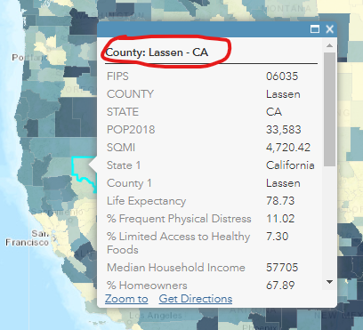
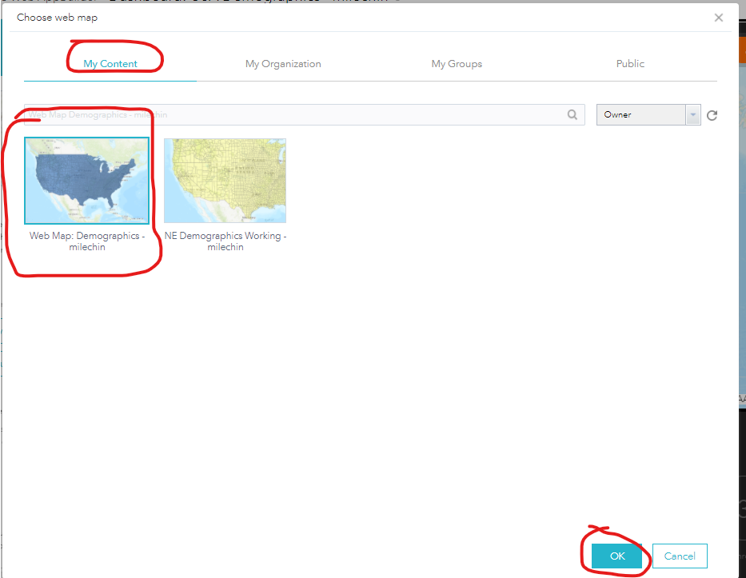
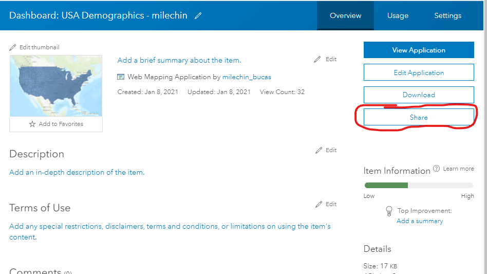

# ArcGIS Online - Part 2
### Author: Dennis Milechin, Research Computing Services, Boston University

## Content
  * [Open Existing Web Map](#open-existing-web-map)
  * [Map Viewer: Configure Pop-Ups](#map-viewer-configure-pop-ups)
  * [Map Viewer: Add Labels](#map-viewer-add-labels)
  * [Map Viewer: Symbolize Data](#map-viewer-symbolize-data)
  * [Map Viewer: Rename Layer](#map-viewer-rename-layer)
  * [Map Viewer: Layer Order](#map-viewer-layer-order)
  * [Map Viewer: Change BaseMap](#map-viewer-change-basemap)
  * [AppBuilder](#appbuilder)
  * [AppBuilder: Layer List Widget](#appbuilder-layer-list-widget)
  * [AppBuilder: Group Filter Widget](#appbuilder-group-filter-widget)
  * [AppBuilder: Bar Plot Widget](#appbuilder-bar-plot-widget)
  * [AppBuilder: Map Viewer Widgets](#appbuilder-map-viewer-widgets)
  * [AppBuilder: Publish](#appbuilder-publish)

## Open Existing Web Map

1. Log onto ArcGIS Online portal. Remember your username has `_bucas` appended to it. (https://bucas.maps.arcgis.com/)
1. Click on `Content` --> `My Content`
1. Click on `Web Map: Demographics - <username>` web map you created in Part 1.
1. Click on `Open in Map Viewer` button in the top left.

\[[top](#content)\]

## Map Viewer: Configure Pop-Ups
**When clicking on a feature on a map, the default pop-ups are not that great.  In this section we will customize these pop-ups.**

1. Hover the mouse over the layer `% Frequent Physical Distress`.
1. Click on the `Show Table` icon to make the attribute table visible.
1. While still hovering the mouse over the layer, click on the three dots `...` and click on `Configure Pop-up`
    
	
    
    **First, let us focus on the `Pop-up Title` section.  Here we want to display the county name and state.  We can do this by using by including the name of the attribute we want to use in the title surrounded by `{}`.  From the attribute table we know county has the attribyte name of `COUNTY` and State has the attribute name of `STATE`.**

1. Enter the following line into the `Pop-up Title` field:
    
	> County: {COUNTY} - {STATE}
    
    

1. Now click `OK` at the bottom of the form.
1. Cover your mouse over a county in the map viewer and click on the county to generate the pop-up.
    
    **Notice how the title of the pop-up now shows the county name and state.**
    
    

    **Next, let's select which attributes we actually want to be visible and how they are labeled.**

1. Hover the mouse over the layer `% Frequent Physical Distress`.
1. Click on the three dots `...` and then `Configure Pop-up`
    
    **Now let's focus on `Pop-up Contents` section.  In this section we will only focus on Display option of `A list of field attributes`.**

1. Click on `Configure Attributes` link at the bottom of the section.
    
	
    
    **A new window will appear where we can select what attributes are displayed and how they are displayed.  The first field `Display` allows you to toggle if an attribute is to be shown or not.**

1. Top left, click on the `Display` checkbox and then click it again to uncheck it.  This will deselect all the fields.
    
	

1. Now click the check box next to the following attributes:
    
    * POPULATION
    * {SQMI}
    * {Life_Expectancy}
    * {F__Frequent_Physical_Distress}
    
    
    
    **We also want to update how the attributes `{SQMI}` and `{POPULATION}` are displayed.**

1. Under the column `Field Alias`, click on `POP2018`.
1. Change the alias name to `Population 2018`.
1. Click on `SQMI` and change the alias name to `Square Miles`.
    
	

1. Click `OK` button.
    
    **Let's reorder the attribute list.**

1. In the `These field attributes will display:` select field, click on `% Frequent Physical Distress..` item to select it.
1. Click on the up arrow to the right of the select field, and move this item to the top.
    
	

1. Move the attribute `Life Expectancy...` to the second item on the list.  The result should look like this:
    
	

1. Click on `OK` button at the bottom to save the changes.
    
    **The pop-ups should now look similiar to the snippet below:**
    
    

\[[top](#content)\]

## Map Viewer: Add Labels

**Next we will add labels for each county, but we will restrict the labels to only appear when the scale of the map is closely zoomed into the map.**

1. Hover the mouse over the layer `% Frequent Physical Distress`.
1. Click on the three dots `...` and then `Create Labels`.
    
	

1. In the new form, for the `Text:` field select `COUNTY` from the drop down menu.
    
	
    
    **In the map viewer, you should see the labels appear for some counties.  Since the counties are so close together, not all the labels can be drawn, otherwise they would overlap.  ArcGIS Online tries to fit as many labels as possible, without overlapping.  We want the labels to only appear when we are zoomed in.**
    
    **In the `Visible Range` section, the black arrow indicates the current map view scale.**
    
    

1. In the map viewer, zoom and and out, and watch the black arrow move.
1. On the left side of the range, click on the `World` field to open a drop down menu.
    
	

1. For the `World` input field, type in `1:1,200,000` and hit `Enter` key on your keyboard.
    
	
    
    **Notice that the visible range has narrowed and the labels will only appear when the black arrow is within the specified range.**  
    
	

1. To make the labels more visible, click on the `Halo` check box and make the font size `14`.
    
	

1. Click `OK` at the bottom of the form.
    
    **The labels are now customized.**

\[[top](#content)\]

## Map Viewer: Symbolize Data

**When we create our dashboard, we want to be able to examine `Life Expectancy` and `% Frequent Physical Distress` attribute values.  In this section we are going to symboloize the `Life Expectancy` attribute.  In our example, one layer cannot symbolize two attribute separately.  We can import the same layer twice and symbolize them differently.**

1. Hit the `Full Extent` button.
1. In `Content` toggle off the visibility of the `% Frequent Physical Distress` layer.
1. Click on `Add` --> `Search For Layers`
1. Make sure the `My Groups` option is selected at the top.
1. Find the layer `USA Demographics` and click the `+` symbol to add this layer.
1. Click the back arrow button at the top to return to the `Content` pane.
    
    **One now should see the `USA Demographics` layer listed and the layer displayed in the map viewer.**
    
    

1. Hover the mouse over the `USA Demographics` layer and click on `Change Style` button.
1. For `Choose an attribute to show` drop down menu choose `Life Expectancy`.
    
    **By default the symbology is going to be the same as the `% Frequent Physical Distress` layer.  Let's change the color of this symbology to make it different from the other layer.**

1. Click on the `OPTIONS` button under the category `Counts and Amounts (Color)`.
    
	
	
1. In the new pane, click on `Symbols` on the right side.
    
	

1. For the `FILL` select the green to white color ramp that is located in the second row and second column.
    
	

1. Then click the invert button that looks like a circle of arrows.
    
	

1. Click `OK`
1. Click `OK` again to save the changes.
    
	

1. Click `DONE` button at the bottom to get back to the `Content` pane.
    
    **The map viewer should look similiar to the snippet below.**
    
    

**To make our map interactions cleaner, for the Life Expectancy layer, let's disable the pop-up feature for this session.**

1. Hover the mouse over the layer `Life Expectancy`.
1. Click on the three dots `...` and click on `Remove Pop-up`.
    
	
    
    **Let's also toggle off the `Life Expectancy` layer for now, before creating the dashboard.**

1. Toggle off the visibility of the `Life Expectancy` layer.
1. Save the map.

\[[top](#content)\]

## Map Viewer: Rename Layer

**We should rename this layer so it represents the symbology it represents.**

1. Hover the mouse over the `USA Demographics` layer.
1. Click on the three dots `...` and then `Rename`.
1. Enter the name as `Life Expectancy` and click `OK`

\[[top](#content)\]

## Map Viewer: Layer Order

**Layer order matters in many GIS applications.  The layer that is listed first is draw on top of all the other layers.**

1. Toggle on the visibility for the `% Frequency Physical Distress` layer.
    
    **You will notice that this layer is not visible because it is drawn under the `Life Expectancy` layer.**

1. Hover the mouse over `% Frequent Physical Distress` layer.
1. Click on the three dots `...` and `Move Up`.
    
    **Now you should see the blue colors more clearly for the `% Frequent Physical Distress` layer.  Having these layer overlap like this is not visually informative, but when we create the dashboard later, we will add the swipe tool that will make comparing these layers easier and more informative.**

\[[top](#content)\]

## Map Viewer: Change BaseMap

**ArcGIS Online allows us to change the basemap and so let's do that in preparation for creating the dashboard.**

1. Click `Basemap` button, to the right of `Add`.
    
	
	
1. Click on `Dark Gray Canvas`.
    
	

    **The basemap now should change and look like the snippet below.**
    
    

1. Save the map.

\[[top](#content)\]

## AppBuilder

**Now that we have a web map created we can import it into an application.**

1. Log onto ArcGIS Online. Remember your username has `_bucas` appended to it. (https://bucas.maps.arcgis.com/)
1. Click on `Content` and then `My Content`.
1. Click on `Create` button located near the top left, to the right of `Add Item`.
    
	
    
    **A new pop-up will appear.  On the right side under `Create Apps` are various applications that can be created.  In this session we will cover some aspects of `Web AppBuilder` and `StoryMaps`.

1. Click on `Web AppBuilder`.
    
	

1. Fill out the form with the following entries:
        
	* `2D`
    * Title: `Dashboard: USA Demographics - <username>`
    * Tags: `Health Rank Data`
    
    

1. Click `OK`.
    
    **After clicking OK, it will open the ArcGIS Web AppBuilder.  There are many options within this environment and we will not cover them all, but we will go through one example.**

1. Left pane, click on the `Dashboard Theme`.
    
	

1. For `Layout`, select the middle one with 3 widgets on the bottom.
    
	
    
    **The main window will reflect the options we had selected and it should look like the snippet below.**
    
    

1. On the left pane, at the top, click on the `Map` tab.
    
	
    
    **Now we need to choose a web map we want to import.  The map will be imported looking like how we saved it. So if you want a different basemap or add layers, you will need to open that Web Map in the Map Viewer interface, make the edits, and then save the map.  The changes will propogated to the applications where the web map is used.**

1. Click on `Choose web map` button.
    
	
    
    **This will open a new pop-up and it will list the Web Maps that are saved in `My Content` and can be imported into the application.**

1. Select the web map you created, `Web Map: Demographics - <username>`.
1. Click `OK`
    
	
    
    **The web map you selected should now appear in the preview pane.**
    
	

1. Click on `Save` button located at the bottom of the left pane.
    
	

\[[top](#content)\]

## AppBuilder: Layer List Widget
**Now we will add custom widgets below the map viewer in our applications. First we are going to add the Layer List widget which will allow users to turn on and off layers in the web map.**

1. Click on the `Widget` tab.
    
	
    
    **This is where we will choose what widgets to add.**

1. Hover the mouse over `1 Widget` icon in the top left of the left pane.
    
    **When hovering over this icon, notice that the Widget 1 spot in the application preview is highlighted in red.  This associates which widget icon in the configuration pane is associated with the one in the applicaiton.**
    
    

1. Click on the `1 Widget` icon.
    
    **When clicking on the widget icon a new window appears listing all the widgets that we can insert.**
    
    

1. Click on the `Layer List` widget.
    
	

1. Click `OK`
    
    **Now the AppBuilder will provide us with additional customization options for this widget.**

1. Uncheck `Show Legend`
1. Uncheck all the options for the `layer context menu`.
    
	

1. Click `OK`
    
    **The widget in location 1 now is occupied by the Layer List widget we just created.**
    
    

1. In the left window pane, cover over the newly added `Layer List` widget to see additional options appear.
   
   
   
   **If you wish to remove this widget you would click the `X` in the top right.  To edit this widget you would click on the pencil icon in the bottom right.  The to left `+` allows you to add another widget as a group.  We will do this later.**

1. Click `Save` at the bottom of the left pane.

\[[top](#content)\]

### AppBuilder: Group Filter Widget
**Next we will add a filter widget which will allow users can choose to view data for only a particular state.**

1. Click on the next available widget spot in the left pane.
   
   

1. Click on the `Group Filter` widget.
   
   

1. Click `OK`

1. Fill out the form with the following values:
    
    * Filter Set Name: `State Filter`
    * Description: `Select state to only show data for the state selected.`
    * Preset Operator: `EQUALS`
    
    

1. For the section `Perform a case sensitive search` section, click on `Add Layer`.
    
	
    
    **This adds another row to the table.**

1. For the second row entery, under column `Layers`, select `% Frequent Physical Distress` layer.
1. Under the `Fields` column, select `STATE` for both layers, as this is the attribute we want to use to filter the data.
1. For `Life Expectancy` layer row, under column `Use Value`, click the radio button.
    
	

1. At the bottom of the form, make sure the following options have a checkmark
    
    * `Start in Simple View`
    * `Hide Widget Options`
    * `Zoom To`
    * `Hide the header and filter selection if only 1 group is configured`
    
    

1. Click `OK`
    
    **The group filter widget now should be visible in the middle widget space.**
    
    

1. Select a `AL` state from the drop down menu and then click `Apply` to apply the filter.
    
	
    
    **You should see only the data for Alabama being visible.**
    
    

1. Hit the `Reset` button to remove the filter.
1. Click the `Save` button at the bottom of the left pane.

\[[top](#content)\]

### AppBuilder: Bar Plot Widget

**Next we will add a bar plot for each layer that will show the top 10 counties, in the visible map extent with, the highest life expectancy and percent frequency of distress.**

1. Click on the final widget space available at the top left pane.
    
	
	
1. Select `Inforgraphic` widget.
    
	
	
1. Next choose the `Column` template.
    
    
	
1. Click `OK`
1. Click on `% Frequent Physical Distress` as the data source.
    
	
    
    **The next window that appears will now allow us to configure the plot.**
	
1. At the top, replace `Infographic` with the name of the layer, `% Frequent Physical Distress`.  This will be the tab name.
    
	

1. Further down the form, click on the top of the preview window, where it says `TITLE OF THE INFOGRAPHIC`.
    
	
    
    **When clicking at the top, options will appear on the right for customization.**

1. Update the `Text` field to `Top 10 Percentage Values`.
    
	

1. Click the middle of the preview window, where it says `No Data`.
    
	
    
    **The middle has many options of what the plot is going to look like.**

1. Under the `Data` tab, have the form contain the following values:
    
    * Display mode: `Display values feature by feature`
    * Category field: `COUNTY`
    * Value Fields: check `% Frequent Physical Distress`
    * Sort By: `% Freqent Physical Distress`
    * Maximum categories: `10`
    
    

1. To the right of `Sort By` field make sure the sort descending (down arrow) is highlighted in blue.
    
	
    
    **Under tabs `Display` and `Marks` provided more options to configure the plot, but for the sake of time, this is as much configuration we will do.**

1. Click `OK`.
    
    **The final widget is now visible in the bottom left.**
    
    

1. Use our group filter widget and filter the data for `AL`. 
    
    **Notice how the bar plot in our third widget automatically updates to show the counties with the highest 10 percentage values.**

1. Hit the `Reset` button.
1. Click the `Save` button at the bottom left pane.
    
    **Lets add another plot for Life Expectancy, but we will add it to the same widget pane as out previous plot.**
    
1. In the left pane, hover over the `Infographic` widget and click on the `+` option.
    
	

1. Repeat the steps above for generating a second plot, except, select the `Life Expectancy` as the data source and update the appropriate field names.
    
	
    
    **When complete, the third widget now should have two tabs, one for `% Frequent Physical Distress` and the other for `Life Expectancy`.**
    
    

1. Click the `Save` button at the bottom left pane.

\[[top](#content)\]

### AppBuilder: Map Viewer Widgets

**At the bottom of the left pane are additional widget spots.  These are associated with the widgets in the map viewer, at the top left corner. Let's add some useful widgets.**

1. Click ont he `1 Widget` icon in the left pane.
    
	

1. Click on `Legend` and then click `OK`.
    
    

1. Leave everything as default in the configuration window and click `OK`.
    
    **Now we have a widget in the map.  Click on this widget it will show you the legend for the layers shown in the map.**
    
    

1. Click on the next available widget space in the left bottom pane.
1. Select the `Swipe` widget.
    
    

1. Click `OK`
1. Leave the default configuration options and click `OK`.
    
    **The swipe tool allows one to easily compare two layers.  Follow the next steps to use the tool.**

1. Make sure both layers are toggled to be visible in the `Layer List` widget.
    
	

1. Click on the `Swipe` widget in the map viewer.
    
	

1. A swipe bar will appear in the middle of the map viewer.  Click and drag the swipe bar left and right to compare the layers.
    
	

1. Click `Save` at the bottom of the left pane.

\[[top](#content)\]

## AppBuilder: Publish

**Now it is time to publish the dashboard so other can view it and interact with it.  First we need to update the permissions of this dashboard so other can see it.**

1. Click on `Home` --> `Content` in the top left corner of the left pane.
    
    
	
1. Click on the dashboard item that we just created, `Dashboard: USA Demographics - <username>`
    
	
	
1. Click on the `Share` button on the right side.
    
	
	
1. Click on the appropriate sharing level you want.
    
    **You can also share your application with the RCS Bootcamp group you joined.**
    
1. Click on `Edit group sharing`.
    
	

1. Select `RCS Bootcamp 2021` group and click `OK`
    
	

1. Click on `Save`
    
    **After clicking save, it may tell you that permissions for some other items need to be updated in order for the web application to work.  If you get this message, click on `Update`.**
    
    

1. Scroll down the page until the bottom.
1. On the right side, there is a `URL` field.  This is the url you can email to people that you want to share the map with.
    
	

1. Scroll back up to the top.
1. To view the application click on `View Application` button in top right.
    
	

\[[top](#content)\]

