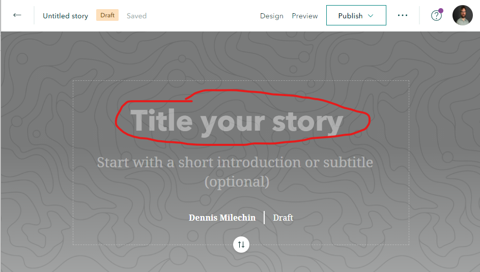

# ArcGIS Online - Part 2
### Author: Dennis Milechin, Research Computing Services, Boston University

## Content
* [Open Existing Web Map](#open-existing-web-map)
* [Map Viewer: Configure Pop-Ups](#map-viewer-configure-pop-ups)  
* [Map Viewer: Add Labels](#map-viewer-add-labels)
* [Map Viewer: Symbolize Data](#map-viewer-symbolize-data)
* [Map Viewer: Rename Layer](#map-viewer-rename-layer)
* [Map Viewer: Layer Order](#map-viewer-layer-order)
* [Map Viewer: Change BaseMap](#map-viewer-change-basemap)  
* [AppBuilder](#appbuilder)
* [AppBuilder: Layer List Widget](#appbuilder-layer-list-widget)
* [AppBuilder: Group Filter Widget](#appbuilder-group-filter-widget)
* [AppBuilder: Bar Plot Widget](#appbuilder-bar-plot-widget)
* [AppBuilder: Map Viewer Widgets](#appbuilder-map-viewer-widgets)
* [AppBuilder: Publish](#appbuilder-publish)  
* [StoryMap](#storymap)
* [StoryMap: Add Text](#storymap-add-text)
* [StoryMap: Add Image](#storymap-add-image)
* [StoryMap: Sidecar](#storymap-sidecar)
* [StoryMap: Preview](#storymap-preview)
* [StoryMap: Add Map](#storymap-add-map)
* [StoryMap: Add Swipe](#storymap-add-swipe)
* [StoryMap: Publish](#storymap-publish)

## Open Existing Web Map

1. Log onto ArcGIS Online portal. Remember your username has `_bucas` appended to it. (https://bucas.maps.arcgis.com/)
1. Click on `Content` --> `My Content`
1. Click on `Web Map: Demographics - <username>` web map you created in Part 1.
1. Click on `Open in Map Viewer` button in the top left.

\[[top](#content)\]

## Map Viewer: Configure Pop-Ups
**When clicking on a feature on a map, the default pop-ups are not that great.  In this section we will customize these pop-ups.**

1. Hover the mouse over the layer `% Frequent Physical Distress`.
1. Click on the `Show Table` icon to make the attribute table visible.
1. While still hovering the mouse over the layer, click on the three dots `...` and click on `Configure Pop-up`
    
	
    
    **First, let us focus on the `Pop-up Title` section.  Here we want to display the county name and state.  We can do this by using by including the name of the attribute we want to use in the title surrounded by `{}`.  From the attribute table we know county has the attribyte name of `COUNTY` and State has the attribute name of `STATE`.**

1. Enter the following line into the `Pop-up Title` field:
    
	> County: {COUNTY} - {STATE}
    
    

1. Now click `OK` at the bottom of the form.
1. Cover your mouse over a county in the map viewer and click on the county to generate the pop-up.
    
    **Notice how the title of the pop-up now shows the county name and state.**
    
    

    **Next, let's select which attributes we actually want to be visible and how they are labeled.**

1. Hover the mouse over the layer `% Frequent Physical Distress`.
1. Click on the three dots `...` and then `Configure Pop-up`
    
    **Now let's focus on `Pop-up Contents` section.  In this section we will only focus on Display option of `A list of field attributes`.**

1. Click on `Configure Attributes` link at the bottom of the section.
    
	
    
    **A new window will appear where we can select what attributes are displayed and how they are displayed.  The first field `Display` allows you to toggle if an attribute is to be shown or not.**

1. Top left, click on the `Display` checkbox and then click it again to uncheck it.  This will deselect all the fields.
    
	

1. Now click the check box next to the following attributes:
    
    * POPULATION
    * {SQMI}
    * {Life_Expectancy}
    * {F__Frequent_Physical_Distress}
    
    
    
    **We also want to update how the attributes `{SQMI}` and `{POPULATION}` are displayed.**

1. Under the column `Field Alias`, click on `POP2018`.
1. Change the alias name to `Population 2018`.
1. Click on `SQMI` and change the alias name to `Square Miles`.
    
	

1. Click `OK` button.
    
    **Let's reorder the attribute list.**

1. In the `These field attributes will display:` select field, click on `% Frequent Physical Distress..` item to select it.
1. Click on the up arrow to the right of the select field, and move this item to the top.
    
	

1. Move the attribute `Life Expectancy...` to the second item on the list.  The result should look like this:
    
	

1. Click on `OK` button at the bottom to save the changes.
    
    **The pop-ups should now look similiar to the snippet below:**
    
    

\[[top](#content)\]

## Map Viewer: Add Labels

**Next we will add labels for each county, but we will restrict the labels to only appear when the scale of the map is closely zoomed into the map.**

1. Hover the mouse over the layer `% Frequent Physical Distress`.
1. Click on the three dots `...` and then `Create Labels`.
    
	

1. In the new form, for the `Text:` field select `COUNTY` from the drop down menu.
    
	
    
    **In the map viewer, you should see the labels appear for some counties.  Since the counties are so close together, not all the labels can be drawn, otherwise they would overlap.  ArcGIS Online tries to fit as many labels as possible, without overlapping.  Having labels at this zoomed out scale is not very informative.  We can restrict the labels to only appear at certain scales, preferably when all the counties can be labeled.**
	
	
    
    **In the `Visible Range` section, the black arrow indicates the current map view scale.**
    
    

1. In the map viewer, zoom and and out, and watch the black arrow move.
1. On the left side of the range, click on the `World` field to open a drop down menu.
    
	

1. For the `World` input field, type in `1:1,200,000` and hit `Enter` key on your keyboard.
    
	
    
    **Notice that the visible range has narrowed and the labels will only appear when the black arrow is within the specified range.**  
    
	

1. To make the labels more visible, click on the `Halo` check box and make the font size `14`.
    
	

1. Click `OK` at the bottom of the form.
    
    **The labels are now customized.**

\[[top](#content)\]

## Map Viewer: Symbolize Data

**When we create our dashboard, we want to be able to examine `Life Expectancy` and `% Frequent Physical Distress` attribute values.  In this section we are going to symboloize the `Life Expectancy` attribute.  In our example, one layer cannot symbolize two attribute separately.  We can import the same layer twice and symbolize them differently.**

1. Hit the `Full Extent` button.
1. In `Content` toggle off the visibility of the `% Frequent Physical Distress` layer.
1. Click on `Add` --> `Search For Layers`
1. Make sure the `My Groups` option is selected at the top.
1. Find the layer `USA Demographics` and click the `+` symbol to add this layer.
1. Click the back arrow button at the top to return to the `Content` pane.
    
    **One now should see the `USA Demographics` layer listed and the layer displayed in the map viewer.**
    
    

1. Hover the mouse over the `USA Demographics` layer and click on `Change Style` button.
1. For `Choose an attribute to show` drop down menu choose `Life Expectancy`.
    
    **By default the symbology is going to be the same as the `% Frequent Physical Distress` layer.  Let's change the color of this symbology to make it different from the other layer.**

1. Click on the `OPTIONS` button under the category `Counts and Amounts (Color)`.
    
	
	
1. In the new pane, click on `Symbols` on the right side.
    
	

1. For the `FILL` select the green to white color ramp that is located in the second row and second column.
    
	

1. Then click the invert button that looks like a circle of arrows.
    
	

1. Click `OK`
1. Click `OK` again to save the changes.
    
	

1. Click `DONE` button at the bottom to get back to the `Content` pane.
    
    **The map viewer should look similiar to the snippet below.**
    
    

**To make our map interactions cleaner, for the Life Expectancy layer, let's disable the pop-up feature for this session.**

1. Hover the mouse over the layer `Life Expectancy`.
1. Click on the three dots `...` and click on `Remove Pop-up`.
    
	
    
    **Let's also toggle off the `Life Expectancy` layer for now, before creating the dashboard.**

1. Toggle off the visibility of the `Life Expectancy` layer.
1. Save the map.

\[[top](#content)\]

## Map Viewer: Rename Layer

**We should rename this layer so it represents the symbology it represents.**

1. Hover the mouse over the `USA Demographics` layer.
1. Click on the three dots `...` and then `Rename`.
1. Enter the name as `Life Expectancy` and click `OK`

\[[top](#content)\]

## Map Viewer: Layer Order

**Layer order matters in many GIS applications.  The layer that is listed first is draw on top of all the other layers.**

1. Toggle on the visibility for the `% Frequency Physical Distress` layer.
    
    **You will notice that this layer is not visible because it is drawn under the `Life Expectancy` layer.**

1. Hover the mouse over `% Frequent Physical Distress` layer.
1. Click on the three dots `...` and `Move Up`.
    
    **Now you should see the blue colors more clearly for the `% Frequent Physical Distress` layer.  Having these layer overlap like this is not visually informative, but when we create the dashboard later, we will add the swipe tool that will make comparing these layers easier and more informative.**

\[[top](#content)\]

## Map Viewer: Change BaseMap

**ArcGIS Online allows us to change the basemap and so let's do that in preparation for creating the dashboard.**

1. Click `Basemap` button, to the right of `Add`.
    
	
	
1. Click on `Dark Gray Canvas`.
    
	

    **The basemap now should change and look like the snippet below.**
    
    

1. Save the map.

\[[top](#content)\]

## AppBuilder

**Now that we have a web map created we can import it into an application.**

1. Log onto ArcGIS Online. Remember your username has `_bucas` appended to it. (https://bucas.maps.arcgis.com/)
1. Click on `Content` and then `My Content`.
1. Click on `Create` button located near the top left, to the right of `Add Item`.
    
	
    
    **A new pop-up will appear.  On the right side under `Create Apps` are various applications that can be created.  In this session we will cover some aspects of `Web AppBuilder` and `StoryMaps`.

1. Click on `Web AppBuilder`.
    
	

1. Fill out the form with the following entries:
        
	* `2D`
    * Title: `Dashboard: USA Demographics - <username>`
    * Tags: `Health Rank Data`
    
    

1. Click `OK`.
    
    **After clicking OK, it will open the ArcGIS Web AppBuilder.  There are many options within this environment and we will not cover them all, but we will go through one example.**

1. Left pane, click on the `Dashboard Theme`.
    
	

1. For `Layout`, select the middle one with 3 widgets on the bottom.
    
	
    
    **The main window will reflect the options we had selected and it should look like the snippet below.**
    
    

1. On the left pane, at the top, click on the `Map` tab.
    
	
    
    **Now we need to choose a web map we want to import.  The map will be imported looking like how we saved it. So if you want a different basemap or add layers, you will need to open that Web Map in the Map Viewer interface, make the edits, and then save the map.  The changes will propogated to the applications where the web map is used.**

1. Click on `Choose web map` button.
    
	
    
    **This will open a new pop-up and it will list the Web Maps that are saved in `My Content` and can be imported into the application.**

1. Select the web map you created, `Web Map: Demographics - <username>`.
1. Click `OK`
    
	
    
    **The web map you selected should now appear in the preview pane.**
    
	

1. Click on `Save` button located at the bottom of the left pane.
    
	

\[[top](#content)\]

## AppBuilder: Layer List Widget
**Now we will add custom widgets below the map viewer in our applications. First we are going to add the Layer List widget which will allow users to turn on and off layers in the web map.**

1. Click on the `Widget` tab.
    
	
    
    **This is where we will choose what widgets to add.**

1. Hover the mouse over `1 Widget` icon in the top left of the left pane.
    
    **When hovering over this icon, notice that the Widget 1 spot in the application preview is highlighted in red.  This associates which widget icon in the configuration pane is associated with the one in the applicaiton.**
    
    

1. Click on the `1 Widget` icon.
    
    **When clicking on the widget icon a new window appears listing all the widgets that we can insert.**
    
    

1. Click on the `Layer List` widget.
    
	

1. Click `OK`
    
    **Now the AppBuilder will provide us with additional customization options for this widget.**

1. Uncheck `Show Legend`
1. Uncheck all the options for the `layer context menu`.
    
	

1. Click `OK`
    
    **The widget in location 1 now is occupied by the Layer List widget we just created.**
    
    

1. In the left window pane, cover over the newly added `Layer List` widget to see additional options appear.
   
   
   
   **If you wish to remove this widget you would click the `X` in the top right.  To edit this widget you would click on the pencil icon in the bottom right.  The to left `+` allows you to add another widget as a group.  We will do this later.**

1. Click `Save` at the bottom of the left pane.

\[[top](#content)\]

### AppBuilder: Group Filter Widget
**Next we will add a filter widget which will allow users can choose to view data for only a particular state.**

1. Click on the next available widget spot in the left pane.
   
   

1. Click on the `Group Filter` widget.
   
   

1. Click `OK`

1. Fill out the form with the following values:
    
    * Filter Set Name: `State Filter`
    * Description: `Select state to only show data for the state selected.`
    * Preset Operator: `EQUALS`
    
    

1. For the section `Perform a case sensitive search` section, click on `Add Layer`.
    
	
    
    **This adds another row to the table.**

1. For the second row entery, under column `Layers`, select `% Frequent Physical Distress` layer.
1. Under the `Fields` column, select `STATE` for both layers, as this is the attribute we want to use to filter the data.
1. For `Life Expectancy` layer row, under column `Use Value`, click the radio button.
    
	

1. At the bottom of the form, make sure the following options have a checkmark
    
    * `Start in Simple View`
    * `Hide Widget Options`
    * `Zoom To`
    * `Hide the header and filter selection if only 1 group is configured`
    
    

1. Click `OK`
    
    **The group filter widget now should be visible in the middle widget space.**
    
    

1. Select a `AL` state from the drop down menu and then click `Apply` to apply the filter.
    
	
    
    **You should see only the data for Alabama being visible.**
    
    

1. Hit the `Reset` button to remove the filter.
1. Click the `Save` button at the bottom of the left pane.

\[[top](#content)\]

### AppBuilder: Bar Plot Widget

**Next we will add a bar plot for each layer that will show the top 10 counties, in the visible map extent with, the highest life expectancy and percent frequency of distress.**

1. Click on the final widget space available at the top left pane.
    
	
	
1. Select `Inforgraphic` widget.
    
	
	
1. Next choose the `Column` template.
    
    
	
1. Click `OK`
1. Click on `% Frequent Physical Distress` as the data source.
    
	
    
    **The next window that appears will now allow us to configure the plot.**
	
1. At the top, replace `Infographic` with the name of the layer, `% Frequent Physical Distress`.  This will be the tab name.
    
	

1. Further down the form, click on the top of the preview window, where it says `TITLE OF THE INFOGRAPHIC`.
    
	
    
    **When clicking at the top, options will appear on the right for customization.**

1. Update the `Text` field to `Top 10 Percentage Values`.
    
	

1. Click the middle of the preview window, where it says `No Data`.
    
	
    
    **The middle has many options of what the plot is going to look like.**

1. Under the `Data` tab, have the form contain the following values:
    
    * Display mode: `Display values feature by feature`
    * Category field: `COUNTY`
    * Value Fields: check `% Frequent Physical Distress`
    * Sort By: `% Freqent Physical Distress`
    * Maximum categories: `10`
    
    

1. To the right of `Sort By` field make sure the sort descending (down arrow) is highlighted in blue.
    
	
    
    **Under tabs `Display` and `Marks` provided more options to configure the plot, but for the sake of time, this is as much configuration we will do.**

1. Click `OK`.
    
    **The final widget is now visible in the bottom left.**
    
    

1. Use our group filter widget and filter the data for `AL`. 
    
    **Notice how the bar plot in our third widget automatically updates to show the counties with the highest 10 percentage values.**

1. Hit the `Reset` button.
1. Click the `Save` button at the bottom left pane.
    
    **Lets add another plot for Life Expectancy, but we will add it to the same widget pane as out previous plot.**
    
1. In the left pane, hover over the `Infographic` widget and click on the `+` option.
    
	

1. Repeat the steps above for generating a second plot, except, select the `Life Expectancy` as the data source and update the appropriate field names.
    
	
    
    **When complete, the third widget now should have two tabs, one for `% Frequent Physical Distress` and the other for `Life Expectancy`.**
    
    

1. Click the `Save` button at the bottom left pane.

\[[top](#content)\]

### AppBuilder: Map Viewer Widgets

**At the bottom of the left pane are additional widget spots.  These are associated with the widgets in the map viewer, at the top left corner. Let's add some useful widgets.**

1. Click ont he `1 Widget` icon in the left pane.
    
	

1. Click on `Legend` and then click `OK`.
    
    

1. Leave everything as default in the configuration window and click `OK`.
    
    **Now we have a widget in the map.  Click on this widget it will show you the legend for the layers shown in the map.**
    
    

1. Click on the next available widget space in the left bottom pane.
1. Select the `Swipe` widget.
    
    

1. Click `OK`
1. Leave the default configuration options and click `OK`.
    
    **The swipe tool allows one to easily compare two layers.  Follow the next steps to use the tool.**

1. Make sure both layers are toggled to be visible in the `Layer List` widget.
    
	

1. Click on the `Swipe` widget in the map viewer.
    
	

1. A swipe bar will appear in the middle of the map viewer.  Click and drag the swipe bar left and right to compare the layers.
    
	

1. Click `Save` at the bottom of the left pane.

\[[top](#content)\]

## AppBuilder: Publish

**Now it is time to publish the dashboard so other can view it and interact with it.  First we need to update the permissions of this dashboard so other can see it.**

1. Click on `Home` --> `Content` in the top left corner of the left pane.
    
    
	
1. Click on the dashboard item that we just created, `Dashboard: USA Demographics - <username>`
    
	
	
1. Click on the `Share` button on the right side.
    
	
	
1. Click on the appropriate sharing level you want.
    
    **You can also share your application with the RCS Bootcamp group you joined.**
    
1. Click on `Edit group sharing`.
    
	

1. Select `RCS Bootcamp 2021` group and click `OK`
    
	

1. Click on `Save`
    
    **After clicking save, it may tell you that permissions for some other items need to be updated in order for the web application to work.  If you get this message, click on `Update`.**
    
    

1. Scroll down the page until the bottom.
1. On the right side, there is a `URL` field.  This is the url you can email to people that you want to share the map with.
    
	

1. Scroll back up to the top.
1. To view the application click on `View Application` button in top right.
    
	

\[[top](#content)\]

## StoryMap

**ArcGIS Online has another web application that allows one to share results and include a narrative.  This application is called a StoryMap. Before creating a StoryMap, let's download a zip file that contains some images we will use in our Story Map**

1. Click on the link below.
   
   [storymap_images.zip](https://bucas.maps.arcgis.com/home/item.html?id=c77c32c2c3184b18906fba6f9c0e3069)
	
1. Click on `Download` in the top right, to download the file in an easy access place, like your desktop.
   
   
   
1. Unzip the file.  

   **The zip file contains three images that we will use in our StoryMap.**
   
   * Life_Expectancy.png
   * Life_expectancy_new_england_south.png
   * RCS-boot-camp-background-bc21.png
	
    **Next we will start the StoryMap application.**
	
1. Navigate to `Content` and `My Content` page.
1. Click on `Create` at the top left.
    
	
    
	**This will open a new tab showing a template of a StoryMap**
    
	
	
1. In the menu at the top, click on `Design`.
    
	
	
	**This opens a new pane on the left side with some basic design options.  As you choose different options, it will apply the change in the main window.**
	
	
	
1. For this session, choose the `Minimal` and the `Summit` theme.
1. Close the pane by clicking `X` in the top right corner.
    
	
	
	**Next we are going to add banner to the top of the page.**
	
1. Below the menu there is a button `Add cover image or video`.  Click on this button.
	
	
	
1. Click on `Browse your files` and find the image `RCS-boot-camp-background-bc21.png`.
1. Click `Add` button.
    
	
	
	**The banner should now be position at the top.  The focus is not that great, so let's adjust it.**
	
	
	
1. Click on the gear icon located at the top center of the banner.

	

1. In the `Image Preview`, click and drag the round grey dot to the top, to refocus the banner.
    
	
	
	
	
1. Click the `Save` button.
    
    **This will center the title of the banner closer to the center.**
	
1. To edit the title of the StoryMap click on `Title your story` to activate the edit mode.
    
	
	
	**In this environment, if you want to edit text, you  just click on the text object and it will got into edit mode. Once done editing, just click somewhere outside that object or hit `enter` on your keyboard.
	
1. Type in the following 
    
	> Story Map Example
	
1. Once done typing, hit the `enter` key on your keyboard or click the mouse outside of the title block.
    
\[[top](#content)\]

## StoryMap: Add Text

**Below the title and author is a "+" icon.  This is how one adds elements to the storymap.**
	
1. Click on the "+" icon to get a menu of options.
    
	
	
1. Click on `Text`.
	
    
	
	**This adds a text element to the Story Map.  Let's add a header for an introduction section.**
	
1. For this element, type in the following and hit `enter` on your keyboard.:
    
	> Introduction
	
	**If you don't have a text cursor, click on the `+` icon again and `Text`.**
	
1. With the mouse, select the word `Introduction`.
    
    **This will activate additional formating options for that element.**
	
	
	
1. Click on `Paragraph` and select `Heading`
	
	
	
	**Next, let's add content to this section.**
	
1. Copy following text to be used later:
    
	> This page takes a spatial look at two attributes from the data set used in the Health Ranking Model developed by University of Wisconsin Population Health Institute.
	
1. Mouse click below the `Introduction` heading and you should see `+` icon appear where additional elements can be added.
1. Click on the `+` icon and select `Text` again.
1. Paste the paragraph.
    
	**Since we are refering to s specific organization in this paragraph, let's add a link that takes a user to their homepage.**

1. Copy the following link:
    
	> https://www.countyhealthrankings.org/explore-health-rankings/rankings-data-documentation
	
1. Select the phrase `Health Ranking Model` in the text.
1. Click on the `Add Link` icon.
    
	
	
1. Paste the link in the field and hit `enter` on yourt keyboard.

	
	
	**Now the phrase `Health Ranking Model` is a link.**
	
1. Add another header section called `Attributes`.
    
	**In this section let's create a list of attributes and their definitions.**
	
1. Copy the following line:
    
	> Life Expectancy - Average number of years a person is expected to live.
	
1. Add another `Text` element and paste the line above.
    
	
	
1. Select the line.
1. Click on `Paragraph` and click `Bulleted List`.
    
	
	
1. To add a second bullet, mouse click at the end of the line, to get the text cursor, and hit `enter` on your keyboard. 
1. Add the following line as the second bullet:
    
	> Frequent physical distress - Percentage of adults reporting 14 or more days of poor physical health per month.
	
1. Make `Life Expectancy` and `Frequent physical distress` phrases bold, to highlight they are attributes.
    
    
	
	**Next let's add a section called `Plots`.**

\[[top](#content)\]

## StoryMap: Add Image

1. Create a header with the title `Plot` and the following one sentence description.
   
   > Below are some exploration plots of the Life Expectancy attribute.
   
    
   
   **Now let's add a plot.**
  
1. Mouse click below the `Plots` section and click on the `+` icon.
1. Click on `Image`.
    
	
	
1. Click on `Browse your files` and find the image `Life_Expectancy.png` from the zip file downloaded earlier.
1. Click `Add` button.
    
    

1. Hover the mouse over the plot, and additional configuration options will appear.
    
    
	
	**Hovering a mouse over an element will sometimes make additional configuration options appear.  They may not always appear in the same location though.**

1. Below the plot, there is an option to add a caption.  Add the following caption:
    
	> Figure 1
	
	
	
1. Below the plot, add a `Text` element with the following text:
    
	> Figure 1 shows the life expectancy distribution for the United States. The average life expectancy is 77.5 years.
	
	
	
1. Repeat the same process as above and add the other plot image `Life_expectancy_new_england_south.png` from the zip file that was downloaded earlier.
1. Add a caption of `Figure 2`
1. Add the following sentence as a `Text` element below the plot.
    
	> Figure 2 shows the distribution of life expectance for New England and East South Ctr Region.
	
	

\[[top](#content)\]

## StoryMap: Sidecar

**We will add an element called Side Car that will progress through the plots an a different way.**

1. Below the plots, create another section called `Sidecar` by inserting another `Text` element.
1. Click the `+` icon to add another element.
1. Select `Sidecar`
    
	
	
1. In the new window select `Docked panel`.
1. Click `Done`
    
    
	
	**The window should look like the snippet below.**
	
	
	
1. On the right side there is an `Add Media` drop down menu.  Click on it and click on `Add image or video`.
    
	

1. In the new window click on `Browse your files` and find the `Life_Expectancy.png` image.
1. Click `Add`.
    
	**The image is cropped.  Let's adjust that.**
	
	
	
1. At the top of the image, click on the gear icon.
    
	
	
1. Under the `Display` tab, make sure `Fit (do not crop)` is selected.
1. Click `Save`
    
	

    **Now the plot is fully visible.**
	
1. On the left side, click the `+` icon and add a new `Text` element with the following text:
    
	> Figure 1: Life expectancy distribution for the United States.
	
	
	
    **Now let's add a second slide.**

1. On the bottom right, click on the large `+` icon.
    
	

    **This will create a new blank slide.  You can see all the slides you have created at the bottom.**
	
	
	
1.  Repeat the above steps and add the second plot, `Life_expectancy_new_england_south.png`, and add the following sentence on the left side:
    
	> Figure 2: Life expectancy distribution for New England and East South Ctr Region.
	
	
	
	
\[[top](#content)\]

## StoryMap: Preview

**Next, let's preview what we have made so far.**

1. At the top of the page, click on `Preview`.
    
    
	
	**This will convert the page into a preview page of what visitors to your storymap will see.**

1. Scroll down the page slowly until you reach the bottom of the page to observer all elements.
1. Get back into edit mode by clicking the `Edit story` button at the top.
    
	

\[[top](#content)\]

## StoryMap: Add Map
**In this section we will add a web map we had created earlier to this StoryMap.**

1. Scroll to the bottom of the Story Map.
1. Click on the `+` icon below the Sidecar element.
1. Click on `Map`.
    
	
	
    **An `Add a map` page will appear.  Here you need to select an already existing map that you want to add.**
	
1. Under the `My Maps` tab, click on the web map you created.  It should be titled as `Web Map: Demographics - <username>`.
    
	
	
	**When you click on a web map, it will take you to a new page where you can configure some simple things on the map.  If you want to make significant changes to the map, such as symbology, you need to open this web map in a Map Viewer to make those changes.**
	
	
	
	**At this stage you can choose what map extent is going to be shown initially when the web map is loaded in the StoryMap.**
	
1. Zoom in on the United States mainland and click `Place Map` button on the bottom right.
   
    
	
	**The map is added to our StoryMap.  If you hover over the map, additional configuration options will appear.  We will leave the map as is for this tutorial.**
	
	

\[[top](#content)\]

## StoryMap: Add Swipe

**In this section we will add the Swipe element.  This will allow users to compare two layers.**

1. Scroll to the bottom of the StoryMap and click on the `+` icon.
1. Click on `Swipe`.
    
	
	
	**You should see an element that looks like the snippet below.**
	
	
	
1. In the left pane, clikc on `Add web map`.
1. Select the same Web Map as you did in the previous examples, titled `Web Map: Demographics - <username>`.
    
	**In the map preview page, look under `All features` at the two layers listed. To the right of the layer name has an eyeball icon that will indicate if the layer is visible or not.  You may need to hover over the layer to see the icon for visible layers.**
	
	
	
1. Make sure the `%Frequent Physical Distress` layer is visible and `Life Expectancy` is not visible, just like the snippet above.
1. Click `Place Map`.
    
	**The left pane now contains the map we imported.**
	
	

	**Now we need to add a map on the right pane.**
	
1. Repeat the process and add the same web map, except make `Life Expectancy` layer visible, and the `% Frequent Physical Distress` layer not visible.
    
	

1. Click `Place Map`.
    
	**Now the right pane contains the `Life Expectancy` map. This element is now complete.**
	
	

1. Click and drag the slider to compare the layers.

	
	
\[[top](#content)\]

## StoryMap: Publish

**Now let's publish the StoryMap so other can see it.**

1. At the top of the page, click on `Publish`.
    
	
	
1. Select the sharing level for your StoryMap.
1. Share your StoryMap with the RCS Bootcamp 2021 group, by searching for the group in the search field at the bottom.
    
	
	
1. Click on the group to select it.
1. Click `Publish Story`.
    
	**ArcGIS Online will check the StoryMap for issues and then if everything is OK, it will show you the final published StoryMap.**
	
\[[top](#content)\]

